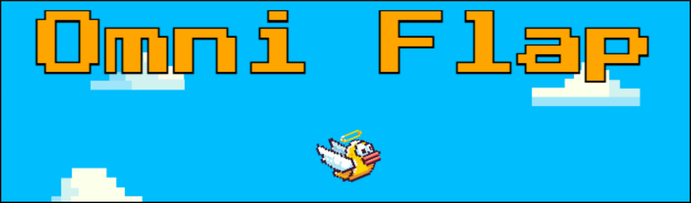

# OmniFlap (Omni-Directional Flappy Bird)

*What if Flappy Bird wasn't so limited*



## Overview

OmniFlap is a browser-based game built using HTML5 Canvas and JavaScript, and brings about a unique twist to the classic Flappy Bird game. In this game, Flappy Bird can move in any direction - but with the rungs coming from every angle the challenge hasn't become easier.  


## Project Goals

The primary goals for this project were:  
1. Explore the fundamentals of game development without utilising a game engine.  
2. Improve proficiency in Vanilla JavaScript and HTML.  
3. Implement a game idea I had for years and deploy it to a website


## Design and Development Process
The game was developed using HTML5 Canvas, which provides basic functionalities for drawing to pixel locations on a canvas. Since it was made without a game engine, the object inputs, collision, and game UI had to be handled manually. The order that the project was   
1. **Built the Player Object**:  
   - The player object was the first game entity, equipped with properties like gravity, velocity, and friction.  
   - I implemented movement using arrow keys or WASD, adding responsiveness to user input.  
2. **Developed Rungs**:  
   - The rungs come from all directions, requiring a transformation system to manage their orientation and placement.  
   - Collisions were calculated by transforming to the rung’s coordinate system and applying basic shape formulas.  
   - This process involved significant trial and error, debugging, and refinement.  
3. **Created UI Elements**:  
   - All UI components were built from scratch, including custom click handlers for each UI element.  
   - Manually positioned UI elements using ratios of `canvasWidth` and `canvasHeight` to maintain responsiveness across screen sizes.  
   - Building the UI proved to be one of the trickiest parts of the project due to the lack of pre-built tools and components.  
4. **Implemented Music Handling**:  
   - Designed custom functions to handle fading music in and out between tracks without blocking gameplay.  
   - Carefully managed transitions and current song states to ensure smooth and immersive audio experience.  
5. **Organized Game Logic**:  
   - Created a `game-manager.js` file to store and manage all game objects and logic.  
   - Introduced a `game-state-machine.js` file to manage the various game states (e.g., pre-game, gameplay, pause, game over).  
   - Each game state object handles entering, exiting, updating, and rendering, allowing for seamless transitions and intuitive state management.  
   - Connected UI button `onClick` events to trigger state transitions effectively.  

## Challenges and Solutions
- **Collision Detection**:  
  - Challenge: Accurately determining collisions in a transformed coordinate system.  
  - Solution: Built a custom transformation method and extensively debugged collision logic to ensure precision.  
- **UI Development**:  
  - Challenge: Creating responsive and functional UI components without pre-made libraries or tools.  
  - Solution: Used pixel-perfect placement based on canvas size ratios and custom click handlers for interactions.  
- **Music Fading**:  
  - Challenge: Smoothly fading music tracks in and out without disrupting gameplay.  
  - Solution: Developed non-blocking custom fade functions integrated with the game’s logic.  


### Live Demo
[Play OmniFlap here!](http://skillsagelearn.com/omniflap)  

---

## Try It Yourself

### How to Run Locally
1. Clone the repository:  
   ```bash
   git clone https://github.com/your-username/omniflap.git
