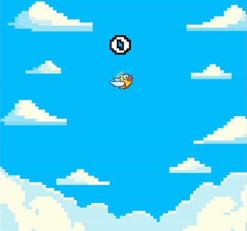

*
What if Flappy Bird wasn't so limited?
*

 

# Overview

  <!-- Left Column: Text -->
  

    

      OmniFlap (Omni-Directional Flappy Bird) is a browser-based game 
built using HTML5 Canvas, and brings about a unique twist to the 
classic Flappy Bird game. In this game, Flappy Bird can move in any direction - 
but with the rungs coming from every angle the challenge hasn't become easier.  
    

    <a style="font-size: 20px;" href="https://skillsagelearn.com/omniflap">Try it here</a>
  

  <!-- Right Column: Link and GIF -->
  

    
  

 

# Project Goals

The primary goals for this project were:  
1. Explore the fundamentals of game development without utilising a game engine.  
2. Improve proficiency in Vanilla JavaScript and HTML.  
3. Implement a game idea I had for years and deploy it to a website

 

# Design and Development Process
The game was developed using HTML5 Canvas, which provides basic functionalities for drawing to pixel locations on a canvas. Since it was made without a game engine, the object inputs, collision, and game UI had to be handled manually. The order that the project was   
1. **Game Objects**:  
   - The two major game objects were the Player and Rung objects which handle drawing, updating, and collision handling
   - For collision handling the Rung is treated as two rectangles and the Player as a circle. The Rung stores the transformations applied to it which are used to calculate collisions 
   - For Rung spawning they are spawned on a random point of a circle with radius beyond the screen and a velocity set to intersect the center of the canvas
2. **UI Elements**:  
   - The UI components were built from scratch. They are organized under the custom class of of UIFrame and the elements include Button, TextElement, ImageElement
   - The sizes and locations of components are defined relative to the UI parent and is set manually using pixel values. These are generally defined relative to the CanvasWidth or CanvasHeight. 
   - The buttons onClick check if the input mouse location is within its bounds and if so run custom functionality. In the main function the click event is then passed to an array of all UIs 
   - If I were making a larger game with more UI I would have made a better UI library for drawing things since it was tedious to test out different pixel positions
3. **Game Logic and Organization**:  
   - The game objects and logic were stored under the class GameManager defined in core/game-manager.js. 
   - The game logic and states are handled under the class GameStateMachine defined in core/game-state-machine.js. This holds various state classes defined under the same file which handle entering, exiting, updating, and rendering to better organize the game state transitions
4. **Artwork and Music**:  
   - All of the artwork in the game was AI generated using microsoft's image generator. This took many attempts to get useful images. Then, I edited the images in GIMP to clean them up for the game. 
   - To draw the rung objects I separated the column heads from the body, then scale the body and connect to the head within the Rung script
   - The music is license free and can be found in the References.  
5. **Organized Game Logic**:  
   - Created a `game-manager.js` file to store and manage all game objects and logic.  
   - Introduced a `game-state-machine.js` file to manage the various game states (e.g., pre-game, gameplay, pause, game over).  
   - Each game state object handles entering, exiting, updating, and rendering, allowing for seamless transitions and intuitive state management.  
   - Connected UI button `onClick` events to trigger state transitions effectively.  

 

# Reflection
While the game was very fun to make, it definitely made me appreciate what game engines have to offer. Instead of being able to focus on the game itself I had to spend considerable time building UI elements from scratch, implement collisions, and debug the Rung draw function for hours. 

The game is also not as well-optimized as a game built in a game engine. Since the velocity of the objects does not incorporate the current frame rate (which most engines do), the game's play will change considerably depending on how fast the computer is. Try running the game along with other programs to see everything slow down.

All in all, however, I succeeded in building this playable game and achieved my goal of learning more about game development. I believe that creating the game without a game engine was difficult but may have provided a better understanding of how game engines function under the hood.

## References/Music

### Menu Music
"Newer Wave" Kevin MacLeod (incompetech.com)
Licensed under Creative Commons: By Attribution 4.0 License
http://creativecommons.org/licenses/by/4.0/

### Game Music
"Voxel Revolution" Kevin MacLeod (incompetech.com)
Licensed under Creative Commons: By Attribution 4.0 License
http://creativecommons.org/licenses/by/4.0/